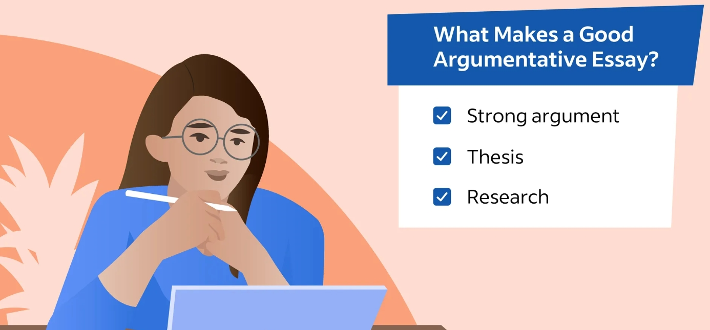

<aside>
💡 A research paper is distinct from IETLS writing, your opinions need to be supported by other’s voice (60%-80%).

</aside>

**argumentative**:  persuasive

purpose is to **convince** your readers.

# 实用短语

- Another persuasive argument is that...
(另一个有说服力的论点是...)
- Another compelling reason is that...
(另一个令人信服的理由是...)
- Furthermore, it is evident that...
(此外,很明显...)
- Moreover, it is clear that...
(而且,很清楚...)
- Another point to consider is that...
(另一个需要考虑的点是...)
- In addition, it is worth noting that...
(另外,值得注意的是...)

# What are persuasive essays?

- Agree or Disagree

Persuasive essays are similar to discussion essays in that you will present your arguments on a topic. However, instead of presenting a balanced view considering both sides, a persuasive essay will focus on one side. 

**To persuade means to convince someone that a particular opinion is the correct one, and so your task when writing a persuasive essay is to convince the reader that your view of the situation is correct.** 

This does not mean you will not consider the other side; indeed, doing so, via counter-arguments, is an important step in strengthening your own argument.

**Below are examples of persuasive essay titles.**

**·  Give your views on same-sex schools.**

**·  Do you agree that artificial intelligence poses a danger to mankind?**

**·  Consider whether human activity has made the world a better place.**

## **Types of support**

Most of the types of support used for a persuasive essay are similar to other essay types, such as using facts, reasons, examples and statistics. If it is a longer (researched) essay, then using evidence from sources, with appropriate citations, will also be essential. There are, however, two types of support which are particularly useful for this type of essay, namely predicting the consequences and counter-arguments. These are considered in more detail below.

### 1. Predicting the consequence

- **Use ‘If’ to predict**

Predicting the consequence helps the reader understand what will happen if something does or does not happen.

For example, to convince your readers that same-sex schools are disadvantageous, you might say,  

> '**If students** do not go to mixed schools, they will lose many opportunities to interact with members of the opposite sex, which may hurt them in their development of important social skills'.
> 
- **Avoid exaggerating** the consequences.

For instance, telling the reader,

> 'If students do not go to mixed schools, they will be shy and will not be able to talk to members of the opposite sex'
> 

exaggerates the consequences of going to single-sex schools and will make your argument less persuasive.
Always use if in this type.

### 2. Counter-arguments

Counter-arguments consider **the opposition's point-of-view,** then present arguments against it ('to be counter to' means 'to be against'). Showing that you are aware of other arguments will strengthen your own. 

This is often the most difficult type of support, as you need to think who the opposition is, consider their view, and think of a good response. Counter-arguments are often presented first in a paragraph. 

Useful language for this type of support are phrases such as 

'**Opponents claim that..., However...**', 

or transition signals such as '**Although**...'. 

The following are examples of counter-arguments for an essay on same-sex schools. Language for counter-arguments is shown in bold.

> **Although it has been suggested that** same sex schools make children more focused on study, **it is generally agreed that** children of the same sex are more likely to talk with each other during class time.
> 

·

**Opponents of:** mixed schools

**claim that:** it is more difficult for students to concentrate when there are members of the opposite sex studying close to them.

**However,** it is much easier for students to be distracted by members of the same sex.

Always use although, opponents xx, however.

In your argument, you can include **both**  a prediction and a counter-argument, **or just one** of them.

# Structure

General: 2-9

Definition: 1-3句

You can only use **quote** in definition part.

Thesis Statement: 1-2句

Include your **arguments**. 如我认为Canada最好，因为食物，气候，人文，交通。

Arguments: Example, need **3-6 arguments.**

Summary: repeat your arguments

Main Body: 

Never write your country, your family, your friends, your feelings.

### Voice of Research Paper

- 20-40% My own voice.
    - You need other’s voice to support your voice.
- 60-80% other voice (citation).

# Sample - Persuasive IELTS Writing

Title: Consider whether human activity has made the world a better place.

**Argument means Reason**

**General Statement:**

History shows that human beings have come a long way from where they started. They have developed new technologies which means that everybody can enjoy luxuries they never previously imagined.

**Thesis Statement:**

However, the technologies that are temporarily making this world a better place to live could well prove to be an ultimate disaster due to, among other things, the creation of nuclear weapons, increasing pollution, and loss of animal species.

**Main Body**

**Body 1: (Argument 1)**

**Topic Sentence: (Main Idea) 1 sentence only** 

The biggest threat to the earth caused by modern human activity **comes from** the creation of nuclear weapons.

**Supporting Sentences: (Reason + Example + Detail) 2-9 sentences**

Although it cannot be denied that countries have to defend themselves, the kind of weapons that some of them currently possess are far in excess of what is needed for defense**. If these weapons were used, they could lead to the destruction of the entire planet.**

**Body 2 (Argument 2)**

**Topic Sentence: (Main Idea)**

Another harm caused by human activity to this earth is pollution.

**Supporting Sentences: (Reason + Example + Detail)**

People have become reliant on modern technology, which can have adverse effects on the environment. For example, reliance on cars causes air and noise pollution. Even seemingly innocent devices, such as computers and mobile phones, use electricity, most of which is produced from coal-burning power stations, which further adds to environmental pollution. **If humans do not curb their direct and indirect use of fossil fuels, the harm to the environment may be catastrophic.**

**Body 3: (Argument 3)**

**Topic Sentence: (Main Idea)**

Animals are an important feature of this earth and the past decades have witnessed the extinction of a considerable number of animal species.

**Supporting Sentences: (Reason + Example + Detail)**

**T**his is the consequence of human encroachment on wildlife habitats, for example deforestation to expand human cities. Some may argue that such loss of species is natural and has occurred throughout earth's history. However, the current rate of species loss far exceeds normal levels, and is threatening to become a mass extinction event.

**Conclusion:**

**Summary:**

In summary, there is no doubt that current human activities **such as the creation of nuclear weapons, pollution, and destruction of wildlife,** are harmful to the earth

**Final Comment:**

It is important for us to see not only the short-term effects of our actions, but their long-term effects as well. Otherwise, human activities will be just another step towards destruction.

5 reference

# How to write Long Essay?

RQ: research question

Make note, not rely on memory

### Sentences:

- do not have more than 2 comma.
- never use “etc.” , “thing”,  not clear

### Vocabulary

- never use “want” , replace it with “intend”

# Sample 2 — Long Essay

- page header
- page number

cover page

- underline -  transition signals, (in college, don’t need)

- counter-arguments
- in-text citation, don’t plagiarize

- don’t use in-text citation in conclusion
- predicting and counter-argument only in main body

# APA & Citation & Format

**need more than 5 reference**

## **A Persuasive Essay MUST include:**

**1.**      APA Format Paper (Page Header + Title Page + Reference Page)

**2.**  	Include titles for introduction (**General Statement** + “Definition” + **Thesis Statement**)

**3.**  	Include titles for each body paragraph (**Topic Sentence** + **Supporting Sentences**)

**4.**  	Include titles for conclusion (**Summary** + **Final Comment**)

**5.**  	Predicting the Consequences **(Bold & Highlight)**

**6.**   	Counter-Arguments (**Bold & Highlight***)*

**7.**  	30 + Transition Signals (**Bold &** underline)

**8.**  	In-text Citation (Author’s last name, Year of publication) https://www.bibcitation.com/

**9.**  	**5 +** References (Alphabetical Order) https://www.bibcitation.com/

**10.**   Times New Roman Font **(Font size: 12)**

**11.**   Correct Spelling

**12.**   Correct Punctuation (. , : ;)

**13.**   Word Limit (700 – 900 Words) (In-text citations, references and titles are not included)

### Citation

- in-text citation can use present and past tense, but recommend present
- If topic sentences have citation, Thesis Sentences also need citations.

### Format

- justify your essay （align to the left and right）
- Use **space: 2.0** from your long essay.
- one essay paragraph other’s voice, you need to find the original