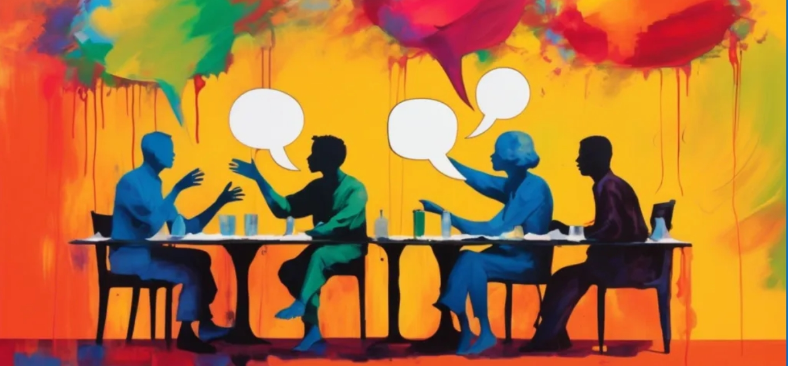
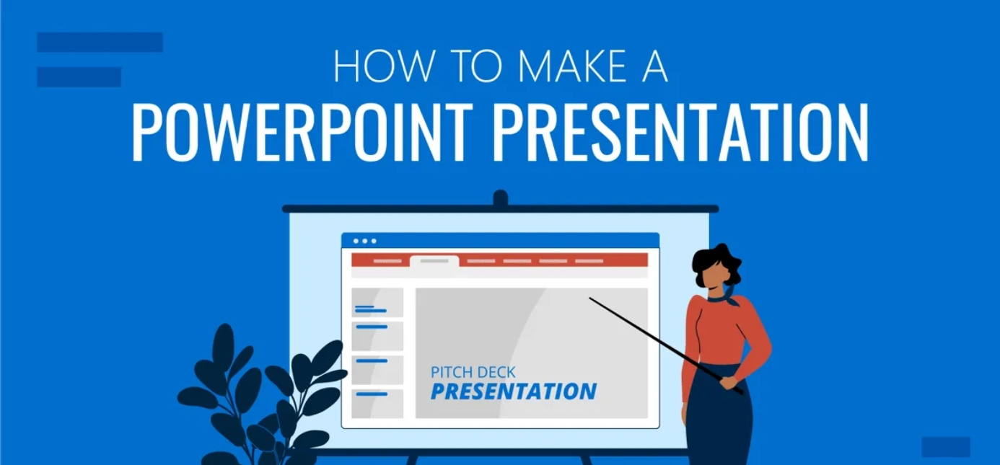
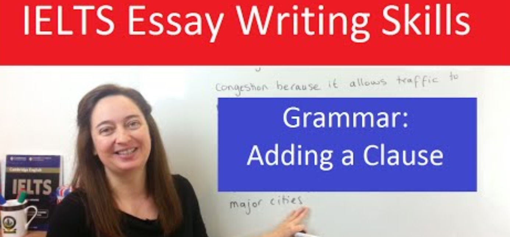
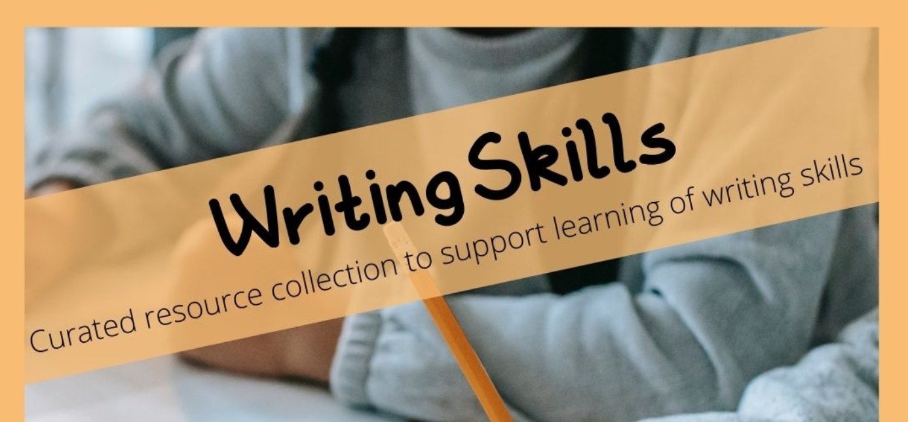
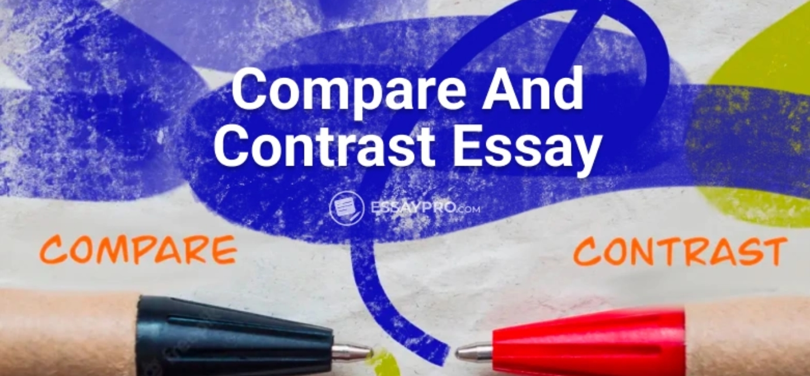

---

## ILAC Kiss Course

|  
《Oral Communication》
 |   
《Presentation Guide》
                                                                                                                                     |  |
|----------------------------------------------------------------------------------------------------------------------------------------------| ------------------------------------------------------------------------------------------------------------------------------------------------------------------------------------------- | ------------------ |
|   
《Writing Grammar》
                          |   
《Writing Skills》
                                                       |   
《Compare & Contrast》
                                                                                   |
|  
《Citation & Plagiarism》
                    |  
《Argumentative Essay》
 |                    |

---
